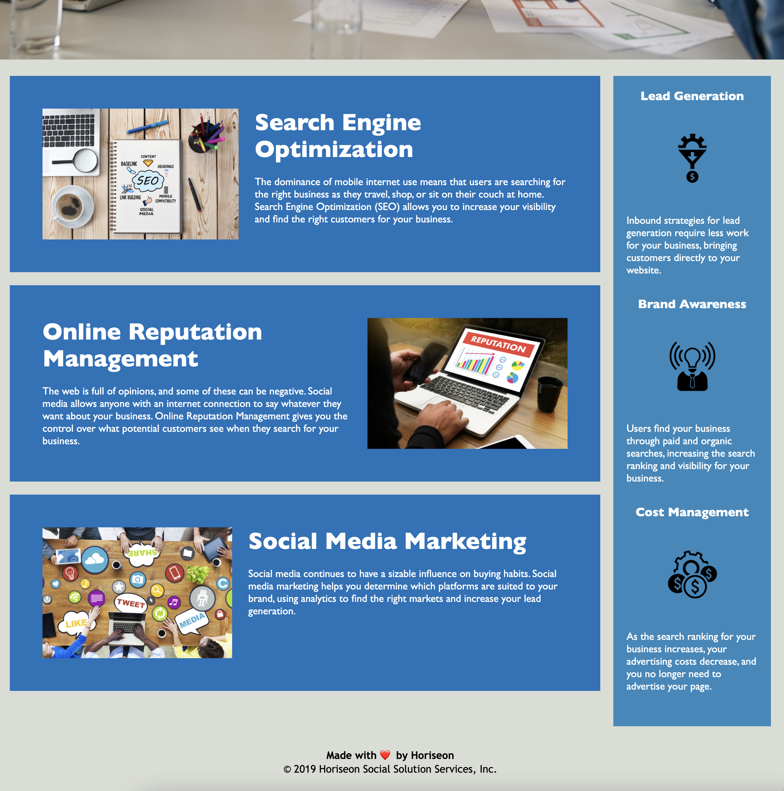

# Horiseon-website

Static HTML and CSS page

## Features:

This Website has a nice layout and if you click on the navbar links, it will take you to the appropriate section.

# Technologies used

2. CSS
3. HTML

# Website

Lower part

### Links

#### Github

https://github.com/KarenHarley/Horiseon-website

#### Website

https://karenharley.github.io/Horiseon-website/

## Contact Info 

KarenHarley88@gmail.com
